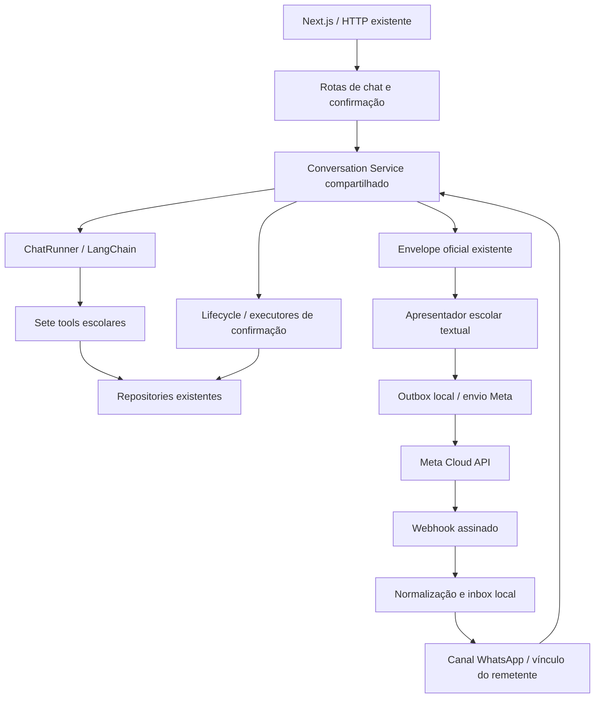

# Design — WhatsApp Channel MVP

## Context

Planejamento baseado no código local e nas seis specs consolidadas, inspecionados em 2026-09-29. Motivação e escopo: [proposal.md](proposal.md). O archive escolar é referência histórica e não será modificado.

| Área observada | Estado atual e consequência para o canal |
| --- | --- |
| `apps/api/src/core/chat-route.ts` | Contém validação HTTP, criação de conversa, `runExclusive`, execução de turno, staging, commit e confirmação. Não há ainda uma fachada independente de HTTP. |
| `core/chat.ts` | `createChatRunner` interpreta contexto, faz uma rodada de tool calls e redação sem tools. Recebe instruções/adapters do módulo e devolve resultado do turno; não salva sozinho. |
| `core/conversations.ts` | `create()` gera ID mas não salva; `save()` grava histórico/contexto juntos. `runExclusive` ordena por conversa e remove filas ociosas. |
| `core/pending-actions.ts` | `stage` não modifica estado global; `confirm` verifica vínculo, recupera recibo concluído antes da revisão, rejeita stale e salva recibo antes da redação opcional. |
| `modules/language-school` | Sete tools, quatro repositories e executores de cadastro/reserva. Reserva é atômica no repository; handoff pode escrever durante o turno e possui contingência determinística. |
| Contexto | `goal`, `name`, `contact`, `courseId`, `slotId`, `leadId`, `revision`. Resolução de slot exige evidência explícita de data/hora correspondente ao slot oficial. |
| `packages/contracts` | Requests estritos de mensagem/IDs, resposta `{ conversationId, reply, results, pendingAction }`, sete resultados e duas prévias. Serão reutilizados, sem cópia. |
| Web | `chat-api.ts` valida schemas; `chat.tsx` guarda ID/ação atual, impede operações simultâneas e repete a mesma confirmação. Apresentadores leem results/preview. Nenhuma alteração visual planejada. |
| Testes | Vitest, `server.inject()`, `ScriptedChatModel`, clock injetado e jornadas com repositories reais. Base auditada: 882 testes/39 arquivos; não executada novamente nesta fase documental. |

### Compatibilidade das specs

`support-chat` descreve controles web que um cliente WhatsApp não permite desabilitar remotamente; seu delta delimita o comportamento por canal sem enfraquecer a rejeição no backend. `human-handoff` hoje diz “sem envio a serviços externos”: o delta esclarece que isso vale para encaminhamento operacional, não para a resposta ao visitante via canal. Não haverá atendente, ticket ou notificação operacional real. Nenhuma regra de catálogo, lead ou reserva muda.

## Goals / Non-Goals

**Goals:** um canal Meta opcional, uma conta/número empresarial e escola demonstrativos, um processo; mesmo motor e contratos; correlação e confirmação verificáveis; falha de transporte independente de escrita; testes sem serviços externos.

**Non-Goals:** motor paralelo, WAHA, SDK/registry de provedores genérico, sessão unificada web/WhatsApp, número do WhatsApp usado automaticamente como contato do lead, novos estados comerciais, templates operacionais, mídia, grupos, campanhas, atendimento ao vivo ou implantação comercial. PostgreSQL/Redis e persistência não serão implementados nesta change.

## Decisions

### D1. Extrair apenas a orquestração compartilhada

Propor `core/conversation-service.ts`, com operações internas de abrir conversa, enviar mensagem, confirmar ação e ler prévia vigente. Mover a lógica existente de `chat-route.ts`, preservando validação injetada pelo módulo, erros públicos e ordem de commits. Rotas continuam validando os mesmos requests e mapeando os mesmos HTTPs; o serviço devolve sucesso validado ou os erros existentes, sem depender de Fastify.

O serviço usa o mesmo `runExclusive` para mensagens, confirmação e leitura consistente da prévia. O canal NÃO envolve uma chamada do serviço em outra aquisição da mesma fila, evitando deadlock. Um método interno de abertura salva apenas a conversa vazia, com ID do backend e defaults oficiais, para vincular o remetente antes de iniciar o primeiro turno; não modifica a atomicidade de um turno. A rota web mantém seu comportamento público.

Alternativas rejeitadas: chamar `server.inject()`/HTTP da própria API em produção, duplicar a rota no canal ou chamar `runTurn` sem staging/commit. A primeira task verifica regressão integral da API antes de habilitar WhatsApp.

### D2. Fronteira de canal e provedor pequena

Organização proposta, a criar somente na implementação:

- `apps/api/src/channels/whatsapp/`: configuração, eventos normalizados, vínculo, inbox/outbox, botões e dispatcher do canal.
- `channels/whatsapp/meta/`: webhook, schemas externos, assinatura e cliente HTTP da Cloud API.
- `modules/language-school/infrastructure/whatsapp-presentation.ts`: apresentação das sete variantes de results e das duas previews existentes. Fornecida pela composição; core e transporte não interpretam regras escolares.
- `app.ts`: injeta serviço, apresentador e adapter. `packages/contracts` e frontend permanecem iguais.

Uma interface interna de envio recebe destinatário validado e mensagem normalizada de texto/botão; retorna aceite com ID do provedor, rejeição conhecida ou resultado indeterminado. Meta implementa com `fetch` injetável, URL Graph fixa e versão explicitamente configurada. Testes usam transporte falso. Recepção Meta projeta eventos para uma união interna estrita; trocar de provedor no futuro não exige alterar negócios. Não instalar o antigo SDK Node arquivado da Meta.

### D3. Configuração e superfície pública

Variáveis propostas apenas em `apps/api/.env.example`, a implementar posteriormente:

| Variável | Política |
| --- | --- |
| `WHATSAPP_ENABLED` | Desabilitado por padrão; API/web/testes continuam iniciando sem configuração Meta. |
| `META_APP_SECRET` | Segredo da aplicação, usado na assinatura; não é verify token. |
| `META_WEBHOOK_VERIFY_TOKEN` | Segredo escolhido para o handshake GET; não é access token. |
| `META_ACCESS_TOKEN` | Bearer usado somente no cliente Meta. |
| `META_WABA_ID`, `META_PHONE_NUMBER_ID` | Única origem empresarial permitida; IDs opacos textuais. |
| `META_GRAPH_API_VERSION` | Versão explícita suportada pela conta; fixar e registrar na implementação/homologação, sem usar `latest`. |
| `WHATSAPP_DEMO_RECIPIENTS` | Lista restrita de identificadores de participantes de teste; obrigatória ao habilitar esta demonstração. Não configura escola/tenant. |

Habilitação incompleta falha no startup com nomes de campos, nunca valores. Não ler `.env` nos testes. Limites locais definidos junto ao canal: 1 MiB por webhook, 10.000 mensagens admitidas por execução e 100 aguardando por remetente; valores são escolhas conservadoras do produto, não alegações de limites Meta. Não expulsar IDs processados para liberar espaço: recusar novas admissões com 503 quando cheio, mantendo duplicatas e status conhecidos reconhecíveis.

Endpoint único: `GET/POST /webhooks/whatsapp/meta`. HTTPS/túnel de homologação permite SOMENTE esse caminho e métodos; `/api/chat`, `/api/chat/confirm`, health e demais caminhos ficam locais. Não publicar toda a porta 3001 sem filtro, pois a API web atual não possui autenticação. Nenhum endpoint de “confirmar por número/actionId” será criado.

### D4. Handshake, assinatura e payloads

GET valida `hub.mode=subscribe`, verify token e challenge escalar não vazio; devolve challenge como texto, 200. Token/mode inválido: 403; parâmetros malformados: 400. Nunca registrar URL completa com query do token.

POST usa parser Fastify encapsulado nessa rota, preservando Buffer original antes de JSON. Validar formato `sha256=<hex>`, HMAC-SHA256 com app secret e comparação constante de buffers de mesmo comprimento; assinatura ausente/inválida: 403. Bytes alterados mesmo com JSON semanticamente igual devem falhar. Corpo acima do limite: 413. Não alterar parser das rotas web.

Após assinatura, validar `object=whatsapp_business_account`, WABA e `metadata.phone_number_id` configurados; origem diferente: 403 sem processamento. Falha de JSON/estrutura externa básica: 400. Percorrer todos `entry[]`, `changes[]`, `messages[]` e `statuses[]`, nunca apenas índice zero.

Schemas externos permitem extensões de metadados da Meta que serão descartadas explicitamente. Campos consumidos têm tipos/tamanhos validados; não há coerção genérica. Timestamp textual de segundos é convertido explicitamente após validação. Eventos internos projetados são estritos e não aceitam campos extras. Campos como `confirmed`, `conversationId`, `schoolId` ou contexto externo jamais entram como estado/autorização.

Texto e `interactive.button_reply` são os eventos conversacionais suportados. `button` de template, list replies não emitidos pelo sistema, mídia, reação e tipos desconhecidos não vão ao modelo; são reconhecidos/ignorados sem baixar URLs ou arquivos. Status é tratado separadamente. Item malformado em lote assinado de origem válida é descartado isoladamente e observado por código sanitizado, sem impedir irmãos válidos; nenhum conteúdo malformado chega ao motor.

### D5. Identidade, inbox e ordem

Chave interna de vínculo: `(provider=meta, WABA, phoneNumberId, senderId)`, onde `senderId` vem exclusivamente da mensagem assinada e validada. Não usar nome de perfil, contato digitado ou `context.from` como identidade. Identificadores permanecem strings opacas; formato alternativo ainda não suportado não será adivinhado a partir do perfil. Metadados do canal não são copiados para `ConversationContext.name/contact`.

Primeiro texto elegível faz lookup/criação síncrona do vínculo e conversa vazia. Duas primeiras mensagens concorrentes obtêm o mesmo vínculo. Outros remetentes têm conversas independentes; sessão web não é mesclada automaticamente, mesmo com o mesmo contato comercial.

Inbox usa chave `(provider, phoneNumberId, inboundMessageId)` e preserva remetente/fingerprint normalizado. Repetição idêntica não cria turno nem novo envio. Mesmo ID com conteúdo/remetente divergente é colisão rejeitada, nunca atualização do original. Admissão e marcação `received` ocorrem antes de retornar 200; a fila local gerenciada inicia o trabalho sem esperar LLM/rede. 200 significa recebido em RAM, NÃO processamento concluído nem persistência.

Estados de entrada: `received → processing → processed`, ou `failed`/`ignored`, com resposta oficial ou erro controlado quando disponível. A fila por vínculo entrega mensagens e botões na ordem de admissão ao serviço compartilhado. O serviço continua protegendo a conversa e o repository continua protegendo a vaga entre conversas. Não há lock global. Ordem de chegada não prova ordem original de envio na rede; não tentar resolver isso reordenando retroativamente mensagens já processadas.

Falha do motor não provoca reexecução automática do mesmo evento. Salvar falha sanitizada e permitir nova mensagem do visitante; não presumir rollback de uma escrita já registrada. Duplicação de webhook não é mecanismo de retry de negócio. A fila deve ser drenável nos testes, capturar rejeições e remover caudas ociosas; nada de promises abandonadas no handler.

### D6. Texto oficial e limitações de formato

O apresentador recebe somente o envelope Zod aprovado. Produz escola/cursos/preços/slots/recibos/handoff a partir de `results`, e prévia a partir de `pendingAction`. Preserva preço nulo versus zero, moeda/periodicidade e data/hora no timezone oficial. Slots incluem `DD/MM/YYYY às HH:mm`, fuso e instrução para selecionar explicitamente uma data/hora; nenhuma resolução nova de “amanhã”/“primeira opção”.

Decisão conservadora do canal: quando houver results ou prévia, usar apresentação determinística e orientações locais; não retransmitir a prosa divergente como fato comercial. Em diálogo sem results/prévia, enviar `reply` como texto livre. O envelope e o histórico originais do motor não são reescritos por essa escolha visual. O apresentador não toma decisões de negócio nem faz consultas extras.

A aceitação de oferta de handoff requer cuidado com essa apresentação: uma oferta apenas gerada, omitida ou não entregue não é uma oferta apresentada. O canal conserva a última resposta efetivamente apresentada, inclusive a oferta canônica quando ela for incluída. Para aceitação curta, exige evidência de delivered/read ou resposta explicitamente correlacionada à mensagem aceita da oferta. Um campo interno opcional de apresentação anterior, fornecido pelo backend ao scope, permite ao adapter escolar reutilizar `resolveHandoffIntent` com essa evidência; `null` impede aceitação sem oferta, e o web mantém seu histórico como fonte padrão. O core apenas transporta esse texto confiável, sem conhecer handoff. Não substituir o histórico da conversa nem permitir que o webhook forneça o texto da oferta. Pedido explícito continua funcionando sem oferta, lead ou evidência de entrega anterior.

Mensagens textuais grandes são divididas em partes numeradas, em fronteiras de texto Unicode, sem cortar valores nem omitir resultado oficial. Referência inicial: texto até 4.096 caracteres; corpo interativo até 1.024, título curto até 20; validar os limites da versão Meta escolhida antes do adapter. Corpo do botão inclui a prévia completa. Se ela não couber, não truncar argumentos nem publicar confirmação sem revisão completa: enviar explicação para corrigir/reduzir os dados e manter a ação não confirmável pelo canal até obter prévia representável.

WhatsApp: “Confirmar cadastro” e “Confirmar aula” (o corpo explicita aula experimental demonstrativa). Web mantém “Confirmar aula experimental”. Somente botões de confirmação; catálogo e seleção de slots continuam textuais. Não alegar que um botão antigo desapareceu/desabilitou no aplicativo WhatsApp: sua validade é decidida no servidor.

### D7. Referência interativa vinculada à ação

Criar referência aleatória imprevisível, sem PII ou args, por ação apresentada. Armazenar em RAM: referência → vínculo do canal, `conversationId`, `actionId`, `kind` e IDs das mensagens Meta que efetivamente transportaram aquela prévia. A referência não é novo actionId nem recibo paralelo; serve somente para localizar a ação oficial. Nunca codificar JSON de argumentos ou aceitar ID digitado como confirmação.

Registrar a referência antes do envio, mas só permitir resolução após aceite identificável do envio. Uma resposta `interactive.button_reply` deve apresentar referência conhecida, origem/remetente correspondentes e `context.id` de uma mensagem enviada dessa prévia. O título do botão é decorativo e não autoriza. Ausência/divergência de vínculo resulta em aviso controlado, sem revelar a conversa proprietária nem chamar a LLM para decidir.

Após resolver, construir internamente `{ conversationId, actionId }`, validar pelo schema existente e chamar a mesma confirmação do serviço web. NÃO exigir que a ação ainda seja a pending atual antes dessa chamada: uma ação concluída precisa devolver recibo histórico mesmo após correções. O lifecycle é autoridade para completed, stale e revisão. Repetições exatas do webhook são deduplicadas; novo clique válido para a mesma ação pode recuperar o recibo, sem nova escrita.

Correção recebida antes do clique é processada antes dele; revisão nova provoca `ACTION_STALE`. Nova prévia recebe referência ligada ao novo actionId. Mensagem sem mudança mantém a mesma ação. “Sim”, `confirmed:true`, botão de cadastro, referência de outra conversa ou botão desconhecido nunca autorizam reserva. Falha após staging mas antes do commit do turno preserva a ação anterior, exatamente como no web.

### D8. Resultado de negócio, outbox e recuperação

Após o serviço devolver, salvar o envelope/erro por inboundMessageId antes de formatar/enviar. A outbox mantém snapshot da resposta e partes de apresentação, sem recomputar tools/modelo em retry. Seu estado não substitui os recibos do lifecycle. Operações do motor são concluídas independentemente da entrega; uma falha no POST à Meta nunca desfaz uma reserva.

| Camada/estado | Significado |
| --- | --- |
| Inbox `received` | Evento admitido em memória; webhook recebeu 200. |
| Inbox `processed` | Motor terminou; resultado/erro oficial está salvo localmente. |
| Outbox `pending` / `sending` | Parte aguardando ou com tentativa em curso. |
| Outbox `accepted` | HTTP válido da Meta devolveu ID de mensagem; ainda não prova entrega. |
| `sent` / `delivered` / `read` | Evidência de status recebido por webhook, associada ao ID enviado. |
| `failed` | Rejeição explícita ou status de falha; não significa falha da reserva. |
| `unknown` | Timeout/conexão perdida/resposta de envio inválida após possível aceite. Não afirmar envio nem ausência dele. |
| `blocked_window` / `superseded` | Não enviar fora da janela ou apresentar novamente botão de prévia ultrapassada. |

MVP sem retry automático de envio, sem backoff/worker distribuído: uma tentativa por parte. Após falha/indeterminação, o visitante pode usar o comando exato de canal `/reenviar`, divulgado na primeira resposta e na documentação. Ele recupera a última resposta da própria conversa que falhou, ficou bloqueada ou indeterminada; não executa ChatRunner nem tools e não é consentimento. Reenvia apenas partes não aceitas; partes indeterminadas podem aparecer duplicadas no WhatsApp — limitação explicitada. Uma parte já entregue/lida não é reenviada automaticamente. Sem resposta recuperável, informa isso sem fabricar resultado.

Antes de reenviar prévia pendente, reler a ação atual pelo serviço. Se substituída, não reenviar o botão antigo; informar que é preciso revisar a prévia atual. Para recibo concluído, preservar os dados históricos. Novo clique no botão original concluído recupera o mesmo recibo. Se o envio da prévia teve resultado indeterminado e não conhecemos seu messageId, esse botão não autoriza; `/reenviar` pode obter aceite identificável para uma nova mensagem da mesma prévia. Não promover um `context.id` externo a mensagem enviada conhecida.

Envios são serializados por destinatário, sem bloquear o processamento de novas correções por chamadas HTTP lentas. Cada parte possui timeout; falha interrompe as demais partes daquele lote. Antes de iniciar envio de um botão, verificar se a ação ainda corresponde à prévia; corrida posterior não altera a proteção final do lifecycle. Não prometer ordem de entrega da Meta; mensagens numeradas e prévia autossuficiente evitam depender dela para autorização.

### D9. Status e janela de atendimento

Status assinados são associados por phoneNumberId + ID de envio conhecido e destinatário compatível quando informado. Não criam conversa, não vão à LLM, não abrem janela e não confirmam ação. Duplicatas são no-op; `read`/`delivered` não regridem para `sent` por chegada fora de ordem. Guardar evidência mínima por estado e falhas, sem assumir uma linha temporal perfeita. Um pequeno buffer limitado de status ainda sem resposta de envio conhecida permite a corrida status-antes-do-HTTP; expira com clock injetado e nunca cria sucesso comercial.

A janela é calculada com o timestamp autenticado da última mensagem válida de texto/botão, nunca com a hora de reentrega de uma duplicata. Atualizar por máximo, rejeitar timestamps futuros incoerentes e checar antes de cada envio/reenvio. Política do MVP: texto/botões apenas dentro de 24 horas; no limite e depois, bloquear. Templates aprovados são o caminho da plataforma fora da janela, mas não serão enviados nesta change. Nova mensagem do visitante permite recuperar uma resposta local com `/reenviar`; status ou retry do webhook não reabrem janela. [Política oficial](https://whatsappbusiness.com/policy/).

### D10. Memória, reinício e limites demonstrativos

Todos os novos registros são cópias defensivas em memória: vínculos, inbox, outbox, referências interativas, status e janela. Permanecem junto da memória existente de conversas, leads, reservas, handoffs, ações e recibos. Deduplicação cobre somente a execução corrente; nenhuma garantia de recuperação de um 200 após crash.

Capturar o instante de início da instância com clock injetado, arredondado para o próximo segundo. Eventos de mensagem anteriores a esse marco não criam turno/conversa; reconhecer e descartar com métrica sanitizada. Isso sacrifica mensagens atrasadas para evitar reproduzir comandos de uma sessão perdida, sem prometer deduplicação durável. A primeira mensagem nova informa que esta é uma nova sessão demonstrativa e que registros anteriores não são recuperados.

Botão de sessão perdida não cria vínculo/conversa automaticamente nem é adaptado para uma ação nova; responder indisponibilidade se a janela permitir e pedir uma nova mensagem textual. Nunca reconstruir lead/booking a partir da mensagem antiga. Depois de reinício, ocupação e recibos se perderam: não testar essa demonstração com reservas comerciais reais.

Registros de dedupe e referências não têm eviction silenciosa durante a execução. Admissão limitada recusa trabalho novo quando cheio; buffers auxiliares/filas ociosas são liberados. Reinício é uma limpeza explícita de toda a demonstração, não uma estratégia de recuperação comercial.

### D11. Segurança e dados pessoais

Somente backend possui segredos Meta/LLM. Logs: códigos, duração, estado, IDs de correlação locais e identidade pseudonimizada; nunca access token, verify token/query, app secret, corpo original, texto do visitante, nome, telefone completo, contato, preview ou payload de botão. Redação de exceções de HTTP remove headers/URL/query/body. Descartar bytes originais depois da verificação/projeção. Status e mídia não alimentam o prompt.

A assinatura autentica a origem do transporte, não comprova identidade civil; número/dispositivo compartilhado continua risco. Um remetente só resolve seu vínculo e seus botões. Metadados `profile.name`, `contacts` e telefone não cadastram um lead por conta própria. Testes de isolamento devem incluir troca de número empresarial, destinatário, referência e ID de mensagem.

Na homologação, expor somente webhook via proxy HTTPS com allowlist de caminho e participantes; verificar externamente que `/api/chat/confirm` não é acessível. Não adicionar autenticação improvisada aos contratos web existentes. A política da plataforma também exige caminho de escalonamento; o handoff local não é substituto operacional. Homologação restrita deve informar um contato real do responsável pelo teste fora das fixtures; disponibilidade pública comercial depende de resolver essa lacuna, sem inventar atendentes no MVP. [Política oficial, automação e escalonamento](https://whatsappbusiness.com/policy/).

## Risks / Trade-offs

| Risco | Mitigação / limite aceito |
| --- | --- |
| ACK em RAM seguido de crash | Pode perder mensagem sem novo webhook; avisar volatilidade. Comercial exige inbox/outbox e estado de negócio duráveis, com transações/constraints. |
| Timeout depois de aceite Meta | Estado unknown e retry explícito; pode duplicar apresentação, nunca reexecutar escrita. Não alegar exactly-once. |
| Correção e clique fora de ordem na rede | Ordem local de admissão; rejeitar revisão stale conhecida. Não prometer reconstituir ordem original de envio. |
| Botão antigo continua visível | Backend rejeita ação stale; recibo completed é recuperável e não nova autorização. |
| Prévia longa para corpo interativo | Não truncar/confirmar sem dados; pedir correção, limite de UX documentado. |
| Nova versão da Meta/payload de identidade | Fixar versão, validar subset, ignorar unsupported; registrar compatibilidade real antes de habilitar conta. |
| Prosa probabilística | Apresentação comercial determinística no canal; interpretação continua sujeita a esclarecimentos e validação. |
| APIs web sem autenticação | Não publicar rotas internas pelo túnel; o canal não aceita IDs arbitrários do visitante. |
| Handoff local não é operação humana | Aviso explícito e ensaio restrito, sem promessas; escalonamento real e políticas antes de uso público. |
| Mais de uma instância | Fora de escopo; filas/mapas e atomicidade atuais são locais. Persistir apenas dedupe não basta. |

## Migration Plan

1. Extrair serviço com WhatsApp desabilitado; comprovar paridade HTTP e invariantes existentes.
2. Implementar fronteiras Meta e estado local com configuração falsa/transportes simulados.
3. Adicionar texto, botões, entrega e recuperação nos milestones de `tasks.md`, um por vez após autorização.
4. Executar suíte completa e homologação assinada local; só depois habilitar conta de teste e HTTPS restrito.
5. Rollback demonstrativo: desabilitar canal e remover assinatura/túnel do teste. Nenhuma migração de dados, pois não existe persistência; reinício perde registros. Web permanece operacional.

## Validation plan

### Automatizado, sem Meta ou OpenAI

Vitest existente; `server.inject()` com Buffer JSON assinado por segredo fictício; transporte Graph injetado; ScriptedChatModel; clock `2030-06-10T12:00:00Z` e fixtures reais. Repositories/casos de uso/lifecycle não são substituídos. Helpers pequenos para assinar evento, drenar fila, capturar mensagem enviada e simular clique com o token realmente emitido.

Cobrir sequência real de catálogo → curso → horários → seleção explícita → prévia de cadastro → clique → prévia de reserva → clique → recibo, com correções, assinaturas inválidas, dois remetentes, duplicatas, disputas e falha de envio. Separar falha de redação após escrita de falha de transporte. Provar mesmo receipt/booking após retry, handoff sem lead e revisão intacta, preço null/zero e prosa divergente. Regressões web/contratos e teste SDK OpenAI com transporte simulado permanecem.

Testar marco de reinício, capacidade, mensagem longa, lote heterogêneo, fila sem deadlock, status duplicado/fora de ordem, janela exata de 24 horas e preview que não cabe. Nenhum teste obrigatório usa credenciais ou sockets externos.

### Homologação posterior com número de teste

Preparar app/WABA/número oficial de teste, destinatários verificados no painel, versão Graph explícita, subscribe `messages`, segredos locais e proxy HTTPS somente para webhook. Confirmar permissões/limites/políticas vigentes na conta; não inserir credenciais, números reais ou URLs contendo tokens no repositório. Uso de Meta/LLM pode ter custos.

Usar harness de desenvolvimento com ScriptedChatModel e aplicação/repositories reais; transporte Meta real habilitado apenas por comando manual. Modelos reais são avaliação adicional opcional. Fixtures de junho de 2030 continuam fixas; relógio de janela/webhook deve refletir a hora real no teste Meta. Clock de negócio pode ser fixado pelo harness, sem aceitar clock do webhook. Não alterar fixtures para facilitar o teste.

Executar: handshake; catálogo; escolha de inglês; horários com data/fuso; nome/contato fictícios; correção antes do botão; cadastro; escolha A/B explícita; botão antigo; confirmação nova; recibo; handoff sem/ com lead; repetição; falha de envio induzida no transporte e `/reenviar`; status de aceite/entrega; reinício e botão antigo. Usar dois participantes autorizados para conflito de vaga. Registrar IDs pseudonimizados, expected/actual e screenshots expurgados, distinguindo aceite de entrega. Sem conta/túnel disponíveis, manter a task manual pendente e registrar o impedimento; testes locais não substituem a prova real.

## Sources and deferred configuration

Fontes primárias consultadas em 2026-09-29:

- [Meta: exemplo de assinatura sobre payload original](https://github.com/fbsamples/whatsapp-api-examples/blob/main/signature-validation-with-webhooks-payloads/app.py) e [recomendações de segurança do sample oficial](https://github.com/fbsamples/business-messaging-sample-tech-provider-app/blob/main/CONTRIBUTING.md). Usados para handshake/assinatura; não copiar práticas de logging nem confundir os segredos do exemplo.
- [Meta: formato interativo e ID de resposta](https://whatsapp.github.io/WhatsApp-Nodejs-SDK/api-reference/messages/interactive/) e [campos/limites do corpo interativo](https://whatsapp.github.io/WhatsApp-Nodejs-SDK/api-reference/types/InteractiveObject/). Documentação histórica de SDK arquivado, usada como referência de formato, não como dependência.
- [WhatsApp Business Messaging Policy](https://whatsappbusiness.com/policy/) para janela, templates e limites operacionais da automação.
- [Meta: exemplo de recepção e configuração local](https://whatsapp.github.io/WhatsApp-Nodejs-SDK/receivingMessages/) e [sample oficial com deduplicação por inbound message ID](https://github.com/fbsamples/whatsapp-business-jaspers-market).

Algumas páginas atuais de `developers.facebook.com` retornaram HTTP 429 nesta pesquisa. Não se fixa aqui uma versão Graph supostamente “mais recente”, prazo máximo de reentrega, tabela de preços ou garantia de ordem da Meta. A implementação do adapter deve confirmar na versão escolhida os payloads de texto/botão/status, limites de texto/título e presença de `context.id`, usando documentação/fixtures oficiais. Se essa versão não fornecer a correlação exigida, revisar o design antes de enfraquecer a validação. IDs de conta, participantes, host HTTPS e versão Graph são configuração posterior; não mudam o desenho nem autorizam implementação nesta execução.
